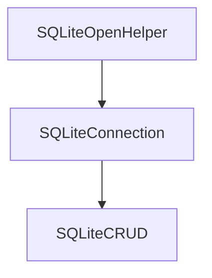

# Android SQLite CRUD
CRUD SQLite for JAVA - ANDROID

## Classes Hierarchy
Class Hierarchy:

```mermaid
graph TD
    B[SQLiteOpenHelper]
    B-->C["SQLiteConnection"]
    C-->D["SQLiteCRUD"];
```
# Authors
- [@G. Mizael Mtz Hdz](https://github.com/martinezmizael)
